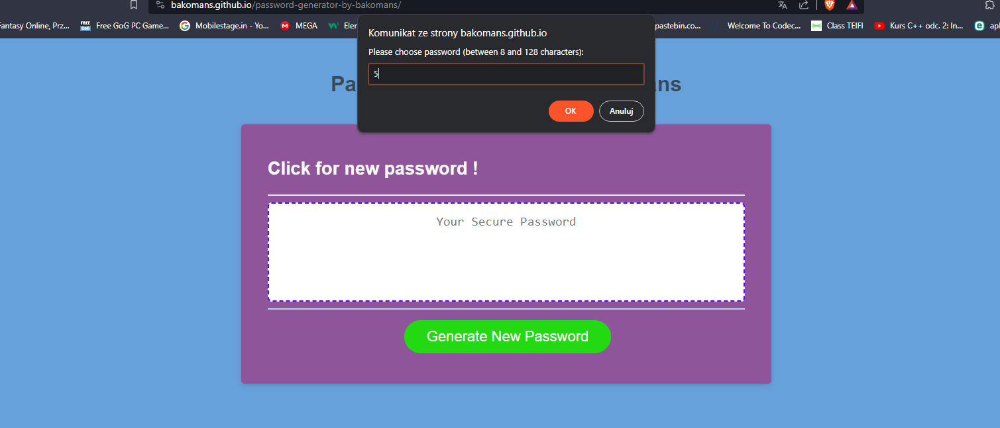

# Password Generator

## About this project

This is a simple JavaScript-based Password Generator web application. It allows users to generate strong and secure passwords with various options, including password length and character types (special characters, numbers, lowercase, and uppercase letters).

## Features

- Generates random passwords .
- Allows users to specify the length of the password (between 8 and 128 characters).
## Usage

This password generator is a helpful tool for creating strong and secure passwords for various online accounts and applications. You can use it to:

- Generate unique and complex passwords to enhance your online security.
- Customize passwords based on specific requirements for different websites and services.
- Create strong, random passwords that are difficult to guess.

## License

This project is licensed as the MIT License 

## Photos 

## Thanks 

Thank to everyone to Look at this project 